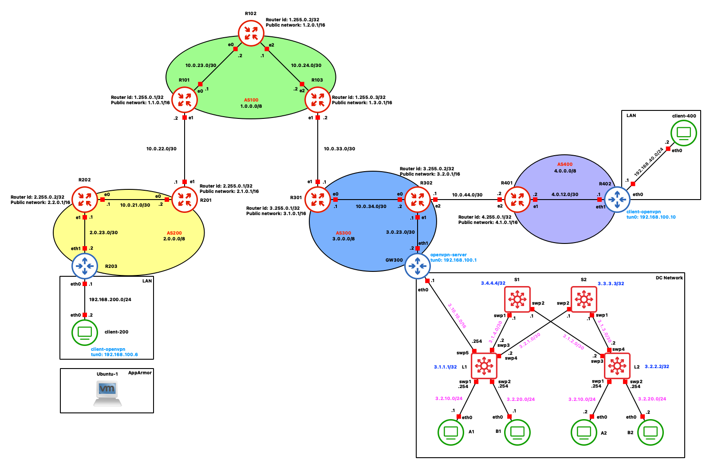

# NSD-project

[<kbd> <br> Presentazione <br> </kbd>](Presentazione.pdf)

### Autore

* **Pierpaolo Spaziani** (matricola 0316331)

### Topologia

<p align="center">  
  
</p>

## Indice
1. [AS100](#as100)
    - [R101](#r101)
    - [R102](#r102)
    - [R103](#r103)
2. [AS200](#as200)
    - [R201](#r201)
    - [R202](#r202)
    - [R203](#r203) [[Firewall](#firewall)]
3. [Client-200](#client-200) [[AppArmor](#apparmor)]
4. [AS300](#as300)
    - [R301](#r301)
    - [R302](#r302)
    - [GW300](#gw300)
5. [DC Network](#dc-network)
    - [Spine 1](#spine-1) | [Spine 2](#spine-2)
    - [Leaf 1](#leaf-1) | [Leaf 2](#leaf-2)
    - [A1](#a1) | [B1](#b1) | [A2](#a2) | [B2](#b2)
6. [AS400](#as400)
    - [R401](#r401)
    - [R402](#r402)
7. [Client-400](#client-400)
8. [OpenVPN](#openvpn)


### AS100

> `AS100` is a transit Autonomous System providing network access to two customers: `AS200` and `AS300`
> - Configure eBGP peering with `AS200` and `AS300`
> - Configure iBGP peering between border routers
> - Configure OSPF
> - Configure LDP/MPLS in the core network

- #### R101
  
  Configurazione delle **interfacce** `eth0`, `eth1` e di loopback `lo` e abilitazione a **MPLS** per `eth0` e `lo`:
  
  ```shell
  interface eth0
   ip address 10.0.23.1/30
   mpls enable
  exit
  !
  interface eth1
   ip address 10.0.22.2/30
  exit
  !
  interface lo
   ip address 1.1.0.1/16
   ip address 1.255.0.1/32
   mpls enable
  exit
  ```
  
  Configurazione del protocollo **BGP**:
  
  ```shell
  router bgp 100
   neighbor 1.255.0.3 remote-as 100
   neighbor 1.255.0.3 update-source 1.255.0.1
   neighbor 10.0.22.1 remote-as 200
   !
   address-family ipv4 unicast
    network 1.1.0.0/16
    neighbor 1.255.0.3 next-hop-self
   exit-address-family
  exit
  ```
  
  Configurazione del protocollo **OSPF**:
  
  ```shell
  router ospf
   ospf router-id 1.255.0.1
   network 1.1.0.0/16 area 0
   network 1.255.0.1/32 area 0
   network 10.0.23.0/30 area 0
  exit
  ```
  
    Configurazione di **LDP**:
  
  ```shell
  mpls ldp
   router-id 1.255.0.1
   ordered-control
   !
   address-family ipv4
    discovery transport-address 1.255.0.1
    !
    interface eth0
    exit
    !
    interface lo
    exit
    !
   exit-address-family
   !
  exit
  ```

- #### R102
    Configurazione delle **interfacce** `eth0`, `eth2` e di loopback `lo` e abilitazione a **MPLS**:
  
  ```shell
  interface eth0
   ip address 10.0.23.2/30
   mpls enable
  exit
  !
  interface eth2
   ip address 10.0.24.1/30
   mpls enable
  exit
  !
  interface lo
   ip address 1.2.0.1/16
   ip address 1.255.0.2/32
   mpls enable
  exit
  ```
  
  Configurazione del protocollo **OSPF**:
  
  ```shell
  router ospf
   ospf router-id 1.255.0.2
   network 1.2.0.0/16 area 0
   network 1.255.0.2/32 area 0
   network 10.0.23.0/30 area 0
   network 10.0.24.0/30 area 0
  exit
  ```
  
    Configurazione di **LDP**:
  
  ```shell
  mpls ldp
   router-id 1.255.0.2
   ordered-control
   !
   address-family ipv4
    discovery transport-address 1.255.0.2
    !
    interface eth0
    exit
    !
    interface eth2
    exit
    !
    interface lo
    exit
    !
   exit-address-family
   !
  exit
  ```

- #### R103
  
    Configurazione delle **interfacce** `eth0`, `eth2` e di loopback `lo` e abilitazione a **MPLS** per `eth2` e `lo`:
  
  ```shell
  interface eth1
   ip address 10.0.33.2/30
  exit
  !
  interface eth2
   ip address 10.0.24.2/30
   mpls enable
  exit
  !
  interface lo
   ip address 1.255.0.3/32
   ip address 1.3.0.1/16
   mpls enable
  exit
  ```
  
  Configurazione del protocollo **BGP**:
  
  ```shell
  router bgp 100
   neighbor 1.255.0.1 remote-as 100
   neighbor 1.255.0.1 update-source 1.255.0.3
   neighbor 10.0.33.1 remote-as 300
   !
   address-family ipv4 unicast
    network 1.3.0.0/16
    neighbor 1.255.0.1 next-hop-self
   exit-address-family
  exit
  ```
  
  Configurazione del protocollo **OSPF**:
  
  ```shell
  router ospf
   ospf router-id 1.255.0.3
   network 1.3.0.0/16 area 0
   network 1.255.0.3/32 area 0
   network 10.0.24.0/30 area 0
  exit
  ```
  
    Configurazione di **LDP**:
  
  ```shell
  mpls ldp
   router-id 1.255.0.3
   ordered-control
   !
   address-family ipv4
    discovery transport-address 1.255.0.3
    !
    interface eth2
    exit
    !
    interface lo
    exit
    !
   exit-address-family
   !
  exit
  ```

### AS200

> `AS200` is a customer AS connected to `AS100`, which provides transit services.
> - Setup eBGP peering with `AS100`
> - Configure iBGP peering
> - Configure internal routing as you wish (with or without OSPF)
> - `R203` is not a BGP speaker
>   - It has a default route towards R202
>   - It has a public IP address from the IP address pool of `AS200`
>   - It is the Access Gateway for the LAN attached to it
>     - Configure dynamic NAT
>     - Configure a simple firewall to allow just connections initiated from the LAN
> - `Client-200` is sensitive, so it must be configured to use *Mandatory Access Control*.
> - `Client-200` is an *OpenVPN client*.

- #### R201
  
  Configurazione delle **interfacce** `eth0`, `eth1` e di loopback `lo`:
  
  ```shell
  interface eth0
   ip address 10.0.22.1/30
  exit
  !
  interface eth1
   ip address 10.0.21.2/30
  exit
  !
  interface lo
   ip address 2.1.0.1/8
   ip address 2.255.0.1/32
  exit
  !
  ```
  
  Configurazione del protocollo **BGP**:
  
  ```shell
  router bgp 200
   neighbor 2.255.0.2 remote-as 200
   neighbor 2.255.0.2 update-source 2.255.0.1
   neighbor 10.0.22.2 remote-as 100
   !
   address-family ipv4 unicast
    network 2.1.0.0/16
    neighbor 2.255.0.2 next-hop-self
   exit-address-family
  exit
  ```
  
  Configurazione del protocollo **OSPF**:
  
  ```shell
  router ospf
   ospf router-id 2.255.0.1
   network 2.1.0.0/16 area 0
   network 2.255.0.1/32 area 0
   network 10.0.21.0/30 area 0
  exit
  ```

- #### R202
  
  Configurazione delle **interfacce** `eth0`, `eth1` e di loopback `lo`:
  
  ```shell
  interface eth0
   ip address 10.0.21.1/30
  exit
  !
  interface eth1
   ip address 2.0.23.1/30
  exit
  !
  interface lo
   ip address 2.2.0.1/16
   ip address 2.255.0.2/32
  exit
  ```
  
  Configurazione del protocollo **BGP**:
  
  ```shell
  router bgp 200
   neighbor 2.255.0.1 remote-as 200
   neighbor 2.255.0.1 update-source 2.255.0.2
   !
   address-family ipv4 unicast
    network 2.0.23.0/30
    network 2.2.0.0/16
    neighbor 2.255.0.1 next-hop-self
   exit-address-family
  exit
  ```
  
  Configurazione del protocollo **OSPF**:
  
  ```shell
  router ospf
   ospf router-id 2.255.0.2
   network 2.0.23.0/30 area 0
   network 2.2.0.0/16 area 0
   network 2.255.0.2/32 area 0
   network 10.0.21.0/30 area 0
  exit
  ```

- #### R203
  
  Configurazione delle **interfacce** `eth0`, `eth1`e della default route verso `R202`:
  
  ```shell
  ip addr add 192.168.200.1/24 dev eth0
  ip addr add 2.0.23.2/30 dev eth1
  ip route add default via 2.0.23.1
  ```
  
  Abilitazione del forwarding degli indirizzi IP:
   ```shell
  sysctl -w net.ipv4.ip_forward=1
  ```

  #### Firewall
  Configurazione del **firewall** che:
  - Accetta i pacchetti che arrivano dall'interfaccia di rete locale e sono destinati alla rete esterna
  - Accetta i pacchetti che appartengono a connessioni già stabilite

  ```shell
  export LAN=eth0
  export NET=eth1

  iptables -F
  iptables -P FORWARD DROP
  iptables -P INPUT DROP
  iptables -P OUTPUT DROP

  iptables -A FORWARD -i $LAN -o $NET -j ACCEPT
  iptables -A FORWARD -m state --state ESTABLISHED -j ACCEPT
  ```
 
  Configurazione **NAT** che modifica l'indirizzo sorgente dei pacchetti in uscita con l'indirizzo IP dell'interfaccia `NET`, consentendo la connettività Internet per i dispositivi sulla rete `LAN`:
  
  ```shell
  iptables -A POSTROUTING -t nat -o eth1 -j MASQUERADE
  ```
  
- #### Client-200
    
    Configurazione dell'**interfaccia** `eth0` e della default route verso il router `R203`:
    
    ```shell
  ip addr add 192.168.200.2/24 dev eth0
  ip route add default via 192.168.200.1
    ```
    
    #### AppArmor
    
    Avendo avuto problemi ad installarlo sulla macchina in GNS3, è stato implementato in una macchina virtuale.

  In **AppArmor** le policy di sicurezza vengono definite attraverso dei profili che descrivono quali risorse (file, directory, ecc.) un'applicazione può accedere e come.
  
  Dato il file eseguibile `example.sh`:
  ```shell
  #!/bin/bash
  echo "This is an apparmor example."  
  touch sample.txt
  rm sample.txt
  ```
  È stato definito il seguente profilo:
  ```shell
  include <tunables/global>

  /home/pier/data/example.sh {
    include <abstractions/base>
    include <abstractions/bash>
    include <abstractions/consoles>
    
    /home/pier/data/example.sh r,
    /usr/bin/bash ix,
    /usr/bin/rm mrix,
    deny /usr/bin/touch x,
    owner /home/*/data/sample.txt w,
  }
  ```
  Con questo profilo attivo, lo script `example.sh` non potrà eseguire il comando `touch` neanche se lanciato con permessi di *root* tramite `sudo`.

### AS300

> `AS300` is a customer AS connected to `AS100`, which provides transit services. It also has a lateral peering relationship with `AS400`.
> - Setup eBGP peering with `AS400` and `AS100`
> - Configure iBGP peering
> - Configure internal routing as you wish (with or without OSPF)
> - `GW300` is not a BGP speaker
>   - It has a default route towards `R302`
>   - It has a public IP address from the IP address pool of `AS300`
>   - It is the Access Gateway for the Data Center network attached to it
>     - Configure dynamic NAT
>     - It's the *OpenVPN server*

- #### R301
  
  Configurazione delle **interfacce** `eth0`, `eth1` e di loopback `lo`:
  
  ```shell
  interface eth0
   ip address 10.0.34.1/30
  exit
  !
  interface eth1
   ip address 10.0.33.1/30
  exit
  !
  interface lo
   ip address 3.1.0.1/16
   ip address 3.255.0.1/32
  exit
  ```
  
  Configurazione del protocollo **BGP**:
  
  ```shell
  router bgp 300
   neighbor 3.255.0.2 remote-as 300
   neighbor 3.255.0.2 update-source 3.255.0.1
   neighbor 10.0.33.2 remote-as 100
   !
   address-family ipv4 unicast
    network 3.1.0.0/16
    neighbor 3.255.0.2 next-hop-self
   exit-address-family
  exit
  ```
  
  Configurazione del protocollo **OSPF**:
  
  ```shell
  router ospf
   ospf router-id 3.255.0.1
   network 3.1.0.0/16 area 0
   network 3.255.0.1/32 area 0
   network 10.0.34.0/30 area 0
  exit
  ```

- #### R302
  
  Configurazione delle **interfacce** `eth0`, `eth1`, `eth2` e di loopback `lo`:
  
  ```shell
  interface eth0
   ip address 10.0.34.2/30
  exit
  !
  interface eth1
   ip address 3.0.23.1/30
  exit
  !
  interface eth2
   ip address 10.0.44.1/30
  exit
  !
  interface lo
   ip address 3.2.0.1/16
   ip address 3.255.0.2/32
  exit
  ```
  
  Configurazione del protocollo **BGP**:
  
  ```shell
  router bgp 300
   neighbor 3.255.0.1 remote-as 300
   neighbor 3.255.0.1 update-source 3.255.0.2
   neighbor 10.0.44.2 remote-as 400
   !
   address-family ipv4 unicast
    network 3.0.23.0/30
    network 3.2.0.0/16
    neighbor 3.255.0.1 next-hop-self
   exit-address-family
  exit
  ```
  
  Configurazione del protocollo **OSPF**:
  
  ```shell
  router ospf
   ospf router-id 3.255.0.2
   network 3.2.0.0/16 area 0
   network 3.2.23.0/30 area 0
   network 3.255.0.2/32 area 0
   network 10.0.34.0/30 area 0
  exit
  ```

- #### GW300
  
  Configurazione dell'**interfaccia** `eth1` e della default route verso `R302`:
  
  ```shell
  ip addr add 3.0.23.2/30 dev eth1
  ip route add default via 3.0.23.1
  ```
  
  Abilitazione del forwarding degli indirizzi IP:
   ```shell
  sysctl -w net.ipv4.ip_forward=1
  ```
  
  Si associano le vlan con id `100` e `200` rispettivamente alle interfacce virtuali `eth0.100` e `eth0.200` per consentire la connettività da e verso l'esterno del datacenter. Si aggiunge l'indirizzo del gateway associato alle due interfacce virtuali e si aggiungono due rotte verso la foglia L1 per raggiungere separatamente i due tenant:
  
  ```shell
  ip link add link eth0 name eth0.100 type vlan id 100
  ip link add link eth0 name eth0.200 type vlan id 200

  ip addr add 3.10.10.1/16 dev eth0.100
  ip addr add 3.10.10.1/16 dev eth0.200

  ip link set eth0.100 up
  ip link set eth0.200 up

  ip route add 3.2.10.0/24 via 3.10.10.254 dev eth0.100
  ip route add 3.2.20.0/24 via 3.10.10.254 dev eth0.200
  ```
  
  Si abilita il NAT verso l'interfaccia `eth1`:
  
  ```shell
  iptables -A POSTROUTING -t nat -o eth1 -j MASQUERADE
  ```

### DC Network

> DC Network is a leaf-spine Data Center network with two leaves and two spines. There are 2 tenants (A and B) in the cloud network, each hosting two virtual machines connected to leaf1 and leaf2. The tenants are assigned one broadcast domain each.
> - Realize VXLAN/EVPN forwarding in the DC network to provide L2VPNs between the
tenants’ machines
> - In L1, enable the connectivity to the external network. In other words, both tenants’
machines must reach the external network through the link between L1 and R303,
including the encapsulation in OpenVPN tunnels when necessary.

- #### Spine 1
  
  Configurazione degli Indirizzi IP per `swp1`,`swp2` e di loopback `lo`:
  
  ```shell
  net add interface swp1 ip add 3.1.4.1/30
  net add interface swp2 ip add 3.1.2.1/30
  net add loopback lo ip add 3.4.4.4/32
  ```
  
  Configurazione del protocollo **OSPF**:
  
  ```shell
  net add ospf router-id 3.4.4.4
  net add ospf network 3.4.4.4/32 area 0
  net add ospf network 3.1.4.0/30 area 0
  net add ospf network 3.1.2.0/30 area 0
  ```
  
  Configurazione di **MP-BGP**:
  
  ```shell
  net add bgp autonomous-system 65000
  net add bgp router-id 3.4.4.4
  net add bgp neighbor swp1 remote-as external
  net add bgp neighbor swp2 remote-as external
  net add bgp evpn neighbor swp1 activate
  net add bgp evpn neighbor swp2 activate
  ```

- #### Spine 2
  
  Configurazione degli Indirizzi IP per `swp1`,`swp2` e di loopback `lo`:
  
  ```shell
  net add interface swp2 ip add 3.2.1.1/30
  net add interface swp1 ip add 3.1.3.1/30
  net add loopback lo ip add 3.3.3.3/32
  ```
  
  Configurazione del protocollo **OSPF**:
  
  ```shell
  net add ospf router-id 3.3.3.3
  net add ospf network 3.3.3.3/32 area 0
  net add ospf network 3.2.1.0/30 area 0
  net add ospf network 3.1.3.0/30 area 0
  ```
  
  Configurazione di **MP-BGP**:
  
  ```shell
  net add bgp autonomous-system 65000
  net add bgp router-id 3.3.3.3
  net add bgp neighbor swp1 remote-as external
  net add bgp neighbor swp2 remote-as external
  net add bgp evpn neighbor swp1 activate
  net add bgp evpn neighbor swp2 activate
  ```

- #### Leaf 1
  
  Configurazione **bridge** e  **VLANs**:
  
  ```shell
  net add bridge bridge ports swp1,swp2,swp5
  net add bridge bridge vids 10,20,100,200
  net add interface swp1 bridge access 10
  net add interface swp2 bridge access 20
  ```
  
  Configurazione delle interfacce di rete:
  
  ```shell
  net add interface swp3 ip add 3.1.4.2/30
  net add interface swp4 ip add 3.2.1.2/30
  net add loopback lo ip add 3.1.1.1/32
  ```
  
  Configurazione del protocollo **OSPF**:
  
  ```shell
  net add ospf router-id 3.1.1.1
  net add ospf network 3.1.4.0/30 area 0
  net add ospf network 3.2.1.0/30 area 0
  net add ospf network 3.1.1.1/32 area 0
  net add ospf passive-interface swp1,swp2
  ```
  
  Configurazione **VXLAN**:
  
  ```shell
  net add vxlan vni10 vxlan id 10
  net add vxlan vni10 vxlan local-tunnelip 3.1.1.1
  net add vxlan vni10 bridge access 10
  net add vxlan vni20 vxlan id 20
  net add vxlan vni20 vxlan local-tunnelip 3.1.1.1
  net add vxlan vni20 bridge access 20

  net add vxlan vni100 vxlan id 100
  net add vxlan vni100 vxlan local-tunnelip 3.1.1.1
  net add vxlan vni100 bridge access 100
  net add vxlan vni200 vxlan id 200
  net add vxlan vni200 vxlan local-tunnelip 3.1.1.1
  net add vxlan vni200 bridge access 200
  ```
  
  Configurazione del protocollo **BGP**, attivazione **EVPN** su `swp3` e `swp4` e pubblicizzazione dei *VNI* (Virtual Network Identifier):
  
  ```shell
  net add bgp autonomous-system 65001
  net add bgp router-id 3.1.1.1
  net add bgp neighbor swp3 remote-as 65000
  net add bgp neighbor swp4 remote-as 65000
  net add bgp evpn neighbor swp3 activate
  net add bgp evpn neighbor swp4 activate
  net add bgp evpn advertise-all-vni
  ```
  
  Configurazione **VLAN**:
  ```shell
  net add vlan 10 ip address 3.2.10.254/24
  net add vlan 20 ip address 3.2.20.254/24

  net add vlan 100 ip address 3.10.10.254/16
  net add vlan 100 ip gateway 3.10.10.1

  net add vlan 200 ip address 3.10.10.254/16
  net add vlan 200 ip gateway 3.10.10.1
  ```

  Configurazione **VRF**:
  ```shell
  net add vxlan vni50 vxlan id 50
  net add vxlan vni50 vxlan local-tunnelip 3.1.1.1
  net add vxlan vni50 bridge access 50
  net add vxlan vni60 vxlan id 60
  net add vxlan vni60 vxlan local-tunnelip 3.1.1.1
  net add vxlan vni60 bridge access 60

  net add vrf TENA vni 50
  net add vlan 50 vrf TENA
  net add vlan 10 vrf TENA
  net add vlan 100 vrf TENA

  net add vrf TENB vni 60
  net add vlan 60 vrf TENB
  net add vlan 20 vrf TENB
  net add vlan 200 vrf TENB
  ```

  Configurazione **BGP per VRF**:
  ```shell
  net add bgp vrf TENA autonomous-system 65001
  net add bgp vrf TENA l2vpn evpn advertise ipv4 unicast
  net add bgp vrf TENA l2vpn evpn default-originate ipv4

  net add bgp vrf TENB autonomous-system 65001
  net add bgp vrf TENB l2vpn evpn advertise ipv4 unicast
  net add bgp vrf TENB l2vpn evpn default-originate ipv4
  ```

- #### Leaf 2
  
  Configurazione **bridge** e  **VLANs**:
  
  ```shell
  net add bridge bridge ports swp1,swp2
  net add interface swp1 bridge access 10
  net add interface swp2 bridge access 20
  ```
  
  Configurazione delle interfacce di rete:
  
  ```shell
  net add interface swp3 ip add 3.1.2.2/30
  net add interface swp4 ip add 3.1.3.2/30
  net add loopback lo ip add 3.2.2.2/32
  ```
  
  Configurazione del protocollo **OSPF**:
  
  ```shell
  net add ospf router-id 3.2.2.2
  net add ospf network 3.1.3.0/30 area 0
  net add ospf network 3.1.2.0/30 area 0
  net add ospf network 3.2.2.2/32 area 0
  net add ospf passive-interface swp1,swp2
  ```
  
  Configurazione **VXLAN**:
  
  ```shell
  net add vxlan vni10 vxlan id 10
  net add vxlan vni10 vxlan local-tunnelip 3.2.2.2
  net add vxlan vni10 bridge access 10
  net add vxlan vni20 vxlan id 20
  net add vxlan vni20 vxlan local-tunnelip 3.2.2.2
  net add vxlan vni20 bridge access 20
  ```
  
  Configurazione del protocollo **BGP**, attivazione **EVPN** su `swp3` e `swp4` e pubblicizzazione dei *VNI* (Virtual Network Identifier):
  
  ```shell
  net add bgp autonomous-system 65002
  net add bgp router-id 3.2.2.2
  net add bgp neighbor swp3 remote-as 65000
  net add bgp neighbor swp4 remote-as 65000
  net add bgp evpn neighbor swp3 activate
  net add bgp evpn neighbor swp4 activate
  net add bgp evpn advertise-all-vni
  ```
  
  Configurazione **VLAN**:
  ```shell
  net add vlan 10 ip address 3.2.10.254/24
  net add vlan 20 ip address 3.2.20.254/24
  ```

  Configurazione **VRF**:
  ```shell
  net add vxlan vni50 vxlan id 50
  net add vxlan vni50 vxlan local-tunnelip 3.2.2.2
  net add vxlan vni50 bridge access 50
  net add vxlan vni60 vxlan id 60
  net add vxlan vni60 vxlan local-tunnelip 3.2.2.2
  net add vxlan vni60 bridge access 60

  net add vrf TENA vni 50
  net add vlan 50 vrf TENA
  net add vlan 10 vrf TENA

  net add vrf TENB vni 60
  net add vlan 60 vrf TENB
  net add vlan 20 vrf TENB
  ```

- #### A1
  
  Configurazione dell'**interfaccia** `eth0` e della default route verso `L1`:
  
  ```shell
  ip addr add 3.2.10.1/24 dev eth0
  ip route add default via 3.2.10.254
  ```

- #### B1
  
  Configurazione dell'**interfaccia** `eth0` e della default route verso `L1`:
  
  ```shell
  ip addr add 3.2.20.1/24 dev eth0
  ip route add default via 3.2.20.254
  ```

- #### A2
  
  Configurazione dell'**interfaccia** `eth0` e della default route verso `L2`:
  
  ```shell
  ip addr add 3.2.10.2/24 dev eth0
  ip route add default via 3.2.10.254
  ```

- #### B2
  
  Configurazione dell'**interfaccia** `eth0` e della default route verso `L2`:
  
  ```shell
  ip addr add 3.2.20.2/24 dev eth0
  ip route add default via 3.2.20.254
  ```
  

### AS400

> `AS400` has a lateral peering relationship with `AS300`.
> - Setup eBGP peering with `AS400` and `AS100`
> - `R402` is not a BGP speaker
>   - It has a default route towards `R401`
>   - It has a public IP address from the IP address pool of `AS400`
>   - It is the Access Gateway for the LAN attached to it
>     - Configure dynamic NAT
>     - Is an *OpenVPN client*.

- #### R401
  
  Configurazione delle **interfacce** `eth0`, `eth1` e di loopback `lo`:
  
  ```shell
  interface eth1
   ip address 4.0.12.2/30
  exit
  !
  interface eth2
   ip address 10.0.44.2/30
  exit
  !
  interface lo
   ip address 4.1.0.1/16
   ip address 4.255.0.1/32
  exit
  ```
  
  Configurazione del protocollo **BGP**:
  
  ```shell
  router bgp 400
   neighbor 10.0.44.1 remote-as 300
   !
   address-family ipv4 unicast
    network 4.0.12.0/30
    network 4.1.0.0/16
   exit-address-family
  exit
  ```
  
  Configurazione del protocollo **OSPF**:
  
  ```shell
  router ospf
   ospf router-id 4.255.0.1
   network 4.0.12.0/30 area 0
   network 4.1.0.0/16 area 0
   network 4.255.0.1/32 area 0
  exit
  ```

- #### R402
  
  Configurazione delle **interfacce** `eth0`, `eth1`e della default route verso `R401`:
  
  ```shell
  ip addr add 192.168.40.1/24 dev eth0
  ip addr add 4.0.12.1/30 dev eth1
  ip route add default via 4.0.12.2
  ```
  
  Abilitazione del forwarding degli indirizzi IP e configurazione **NAT** che modifica l'indirizzo sorgente dei pacchetti in uscita con l'indirizzo IP dell'interfaccia `NET`, consentendo la connettività Internet per i dispositivi sulla rete `LAN`:
   ```shell
  sysctl -w net.ipv4.ip_forward=1
  iptables -A POSTROUTING -t nat -o eth1 -j MASQUERADE
  ```
  
 - #### Client-400
    
      Configurazione dell'**interfaccia** `eth0` e della default route verso `R402`:
    
    ```shell
    ip addr add 192.168.40.2/24 dev eth0
    ip route add default via 192.168.40.1
    ```

### OpenVPN

Per avviare il servizio **OpenVPN** basta eseguire i seguenti comandi sulle relative macchine:

  
 - #### Client-200
    
      Nella directory `/root/ovpn`:
    
    ```shell
    openvpn client1.ovpn
    ```
    
 - #### GW300

      Nella directory `/root/CA/server`:
      
    ```shell
    openvpn server.ovpn
    ```
    
 - #### R402

      Nella directory `/root/ovpn`:
      
    ```shell
    openvpn client2.ovpn
    ```

  #### Configurazione

- `GW300`

  Inizializzazione PKI e build della Certification Authority:

  ```shell
  # in /usr/share/easy-rsa
  ./easyrsa init-pki
  ./easyrsa build-ca nopass
  ```

  Generazione del certificato del server (`GW300`) e dei client (`Client-200` e `R402`):

  ```shell
  ./easyrsa build-server-full server nopass
  ./easyrsa build-client-full client1 nopass
  ./easyrsa build-client-full client2 nopass
  ```

  Generazione dei parametri Diffie Hellman:

  ```shell
  ./easyrsa gen-dh
  ```

  Avendo la directory `root` persistente, si sposta tutto lì:

  ```shell
  mkdir /root/CA
  mkdir /root/CA/server
  mkdir /root/CA/client1
  mkdir /root/CA/client2

  cp pki/ca.crt /root/CA/
  cp pki/issued/server.crt /root/CA/server/
  cp pki/private/server.key /root/CA/server/
  cp pki/dh.pem /root/CA/server/

  cp pki/issued/client1.crt /root/CA/client1/
  cp pki/private/client1.key /root/CA/client1/

  cp pki/issued/client2.crt /root/CA/client2/
  cp pki/private/client2.key /root/CA/client2/
  ```

Distribuzione del materiale crittografico sui client:

- `Client-200`

  ```shell
  mkdir ovpn
  cd ovpn
  vim ca.crt      # copy-paste server's /root/CA/ca.crt
  vim client1.crt   # copy-paste server's /root/CA/client1/client1.crt
  vim client1.key   # copy-paste server's /root/CA/client1/client1.key
  ```
- `R402`
  ```shell
  mkdir ovpn
  cd ovpn
  vim ca.crt      # copy-paste server's /root/CA/ca.crt
  vim client2.crt   # copy-paste server's /root/CA/client2/client2.crt
  vim client2.key   # copy-paste server's /root/CA/client2/client2.key
  ```

Creazione dei file di configurazione:

- `GW300`
Per comodità si copia in `root/CA/server` il certificato `ca.crt`:
  
  ```shell
  cp /root/CA/ca.crt /root/CA/server
  ```
  
  In questa directory si crea il file di configurazione `server.ovpn`:
  
  ```shell
  port 1194
  proto udp
  dev tun
  ca ca.crt
  cert server.crt
  key server.key
  dh dh.pem
  server 192.168.100.0 255.255.255.0
  push "route 192.168.200.2 255.255.255.255"
  push "route 192.168.40.0 255.255.255.0"
  push "route 3.2.10.0 255.255.255.0"
  route 192.168.200.2 255.255.255.255
  route 192.168.40.0 255.255.255.0
  client-config-dir ccd
  client-to-client
  keepalive 10 120
  cipher AES-256-GCM
  ```
  
  Si crea una directory `ccd` (*Client Configuration Directory*) e al suo interno un file `client2`:
  
  ```shell
  mkdir ccd
  vim ccd/client2
  ```
  il cui contenuto è:
  
  ```shell
  iroute 192.168.40.0 255.255.255.0
  ```
  che indica che `client2` è il next-hop per `192.168.40.0`.
  
- `Client-200`
  Nella directory `root/ovpn` si crea il file di configurazione `client1.ovpn`:
  
  ```shell
  client
  dev tun
  proto udp
  remote 3.0.23.2 1194
  resolv-retry infinite
  ca ca.crt
  cert client1.crt
  key client1.key
  remote-cert-tls server
  cipher AES-256-GCM
  ```
  
- `R402`
  Nella directory `root/ovpn` si crea il file di configurazione `client2.ovpn`:
  
  ```shell
  client
  dev tun
  proto udp
  remote 3.0.23.2 1194
  resolv-retry infinite
  ca ca.crt
  cert client2.crt
  key client2.key
  remote-cert-tls server
  cipher AES-256-GCM
  ```
